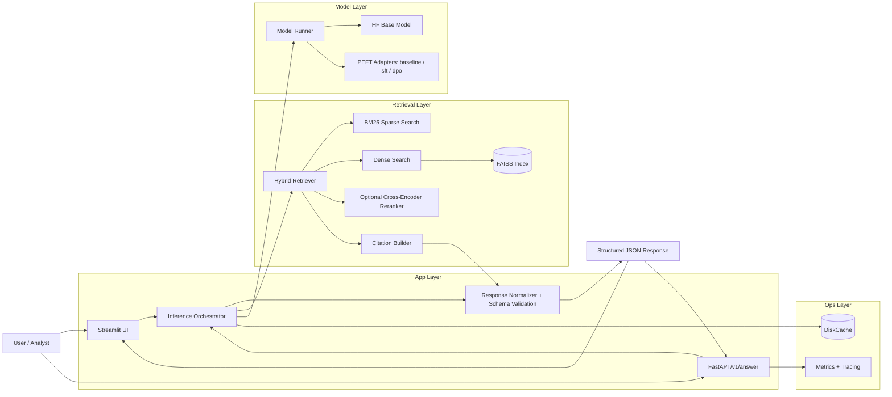
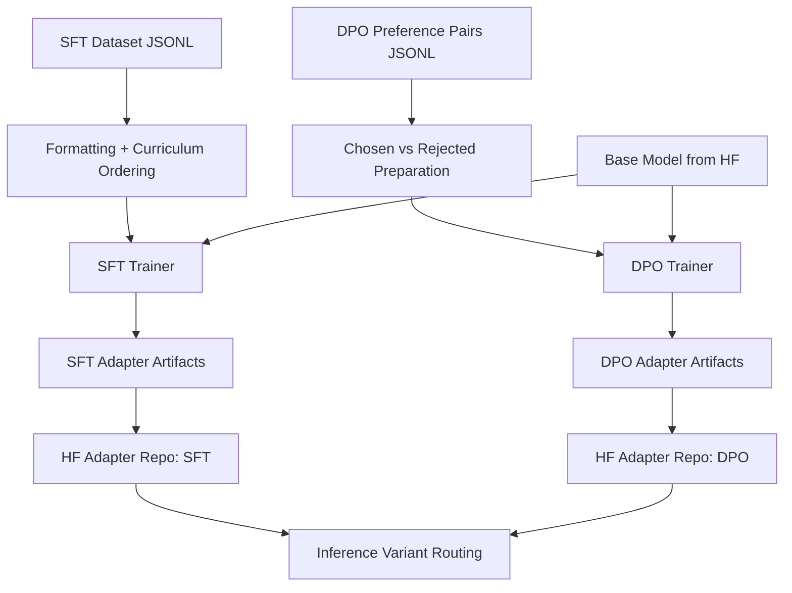
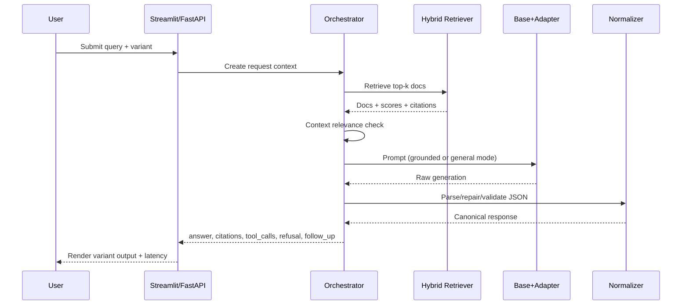
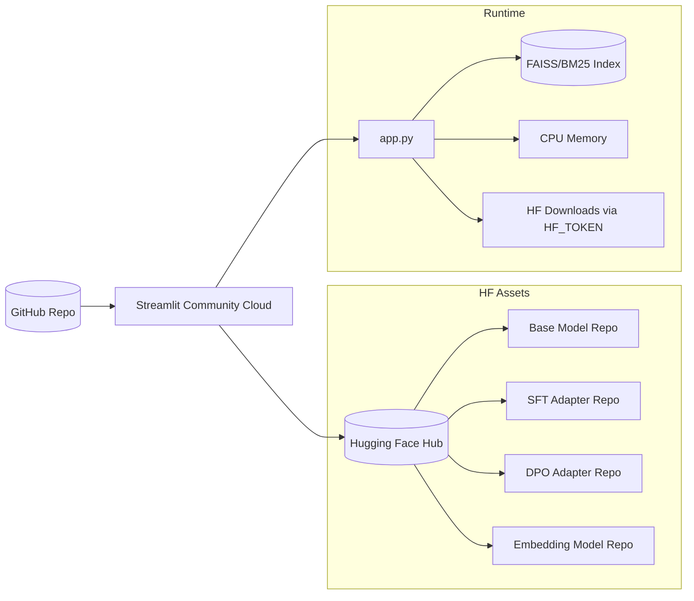
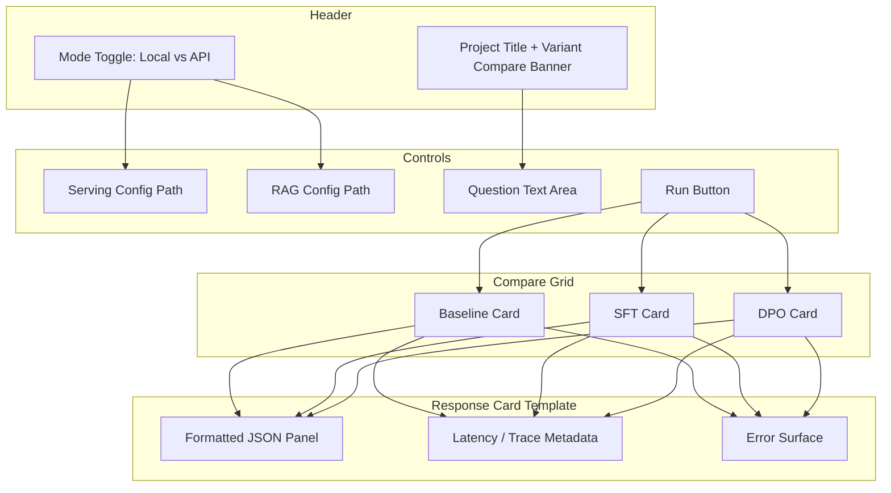
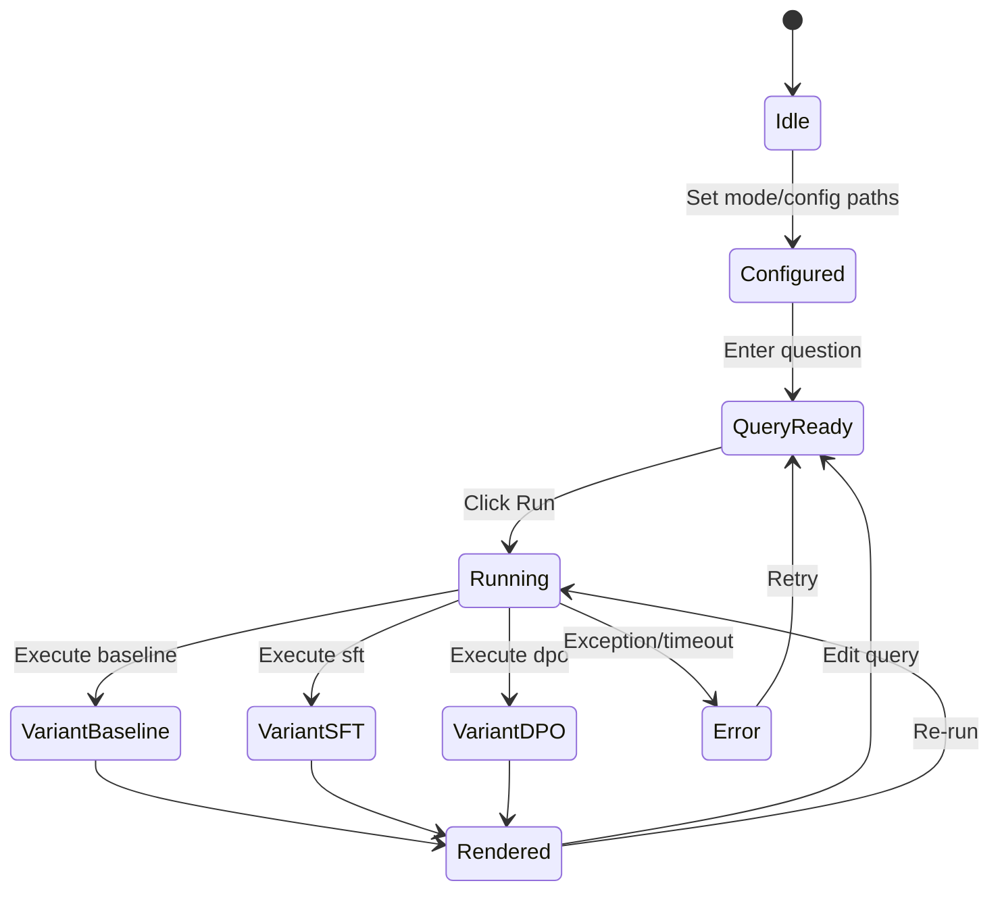
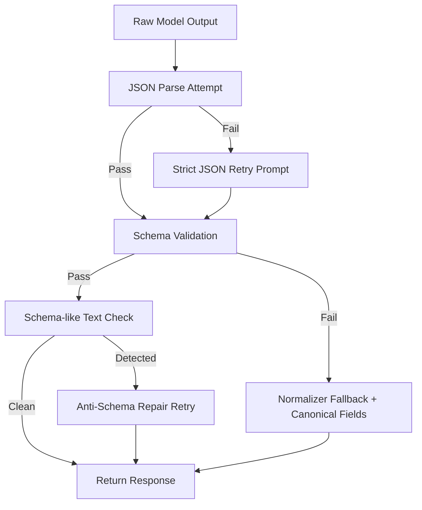

# HealthcareOps LLM Fine-Tuning and RAG Benchmark Suite

Production-style, end-to-end LLM workflow for healthcare operations:

- Baseline Hybrid RAG (BM25 + dense FAISS retrieval)
- PEFT fine-tuning (LoRA / optional QLoRA path)
- Preference optimization (DPO)
- JSON schema-constrained outputs
- Evaluation harness for regression metrics
- FastAPI serving + Streamlit demo
- Hugging Face hosted base/adapters for remote inference

The repository is CPU-first friendly with a tiny profile for smoke tests and demos.

---

## 1. What This Project Solves

Raw LLM outputs are often unreliable for operations workflows:

- answers may be ungrounded,
- structure can be invalid for downstream automation,
- behavior changes are hard to measure.

This project addresses that by combining retrieval grounding, adapter-based tuning, strict output contracts, and repeatable evaluation.

---

## 2. Technical Workflow

1. **Data + schema setup**
- Domain corpus and train/eval datasets are JSONL.
- Responses must match `data/schemas/response_schema.json`.

2. **Hybrid retrieval baseline**
- Sparse search: BM25.
- Dense search: sentence embeddings + FAISS inner-product index.
- Hybrid fusion via normalized weighted scoring.

3. **SFT adapter training**
- LoRA-based supervised fine-tuning.
- QLoRA path is supported but can fall back depending on environment.

4. **DPO adapter training**
- Preference tuning with chosen/rejected pairs.
- Improves behavior against weak or undesired outputs.

5. **Inference variants**
- `baseline`: base model only
- `sft`: base + SFT adapter
- `dpo`: base + DPO adapter

6. **Evaluation**
- JSON validity
- Groundedness
- Tool accuracy
- Refusal/safety alignment

7. **Serving and demo**
- FastAPI endpoint (`/v1/answer`)
- Streamlit compare view for baseline vs SFT vs DPO

---

## 3. Model and Adapter Strategy

Current quick profile (`configs/base_quick.yaml`) uses:

- Base model: `tpranav/HealthcareLLM`
- Embedding model: `sentence-transformers/all-MiniLM-L6-v2`

Tiny serving profile (`configs/serving_tiny.yaml`) points adapters to:

- `tpranav/HealthcareLLM-sft-tiny`
- `tpranav/HealthcareLLM-dpo-tiny`

Inference loads from Hugging Face Hub using `HF_TOKEN` when needed.

---

## 4. Project Structure

- `configs/` runtime and experiment configs
- `data/` sample corpora, train/eval sets, schema
- `src/rag/` index + retriever
- `src/training/` SFT, DPO, distillation logic
- `src/eval/` evaluator + metrics
- `src/serving/` FastAPI app, prompting, model runner, batching
- `scripts/` CLI entrypoints
- `demo/app.py` local Streamlit app source
- `app.py` Streamlit Cloud entrypoint

---

## 4.1 Architecture Diagrams

### End-to-End Platform Architecture



### Training and Alignment Pipeline



### Inference Request Lifecycle



### Deployment Topology (Cloud)



### Streamlit UI Architecture



### UI Interaction State Flow



### Reliability Controls (Output Quality)



Additional diagram copy remains in `docs/ARCHITECTURE_DIAGRAMS.md`.

---

## 5. Prerequisites

- Python 3.10+ recommended
- Windows PowerShell commands shown below (adjust for bash if needed)
- Hugging Face token (`HF_TOKEN`) for private model/adapters

---

## 6. Quick Start (Tiny CPU Profile)

### 6.1 Environment

```powershell
python -m venv .venv
.\.venv\Scripts\activate
pip install -r requirements.txt
```

Set HF token:

```powershell
$env:HF_TOKEN="your_hf_token"
```

### 6.2 Build tiny retrieval index

```powershell
python scripts\build_index.py --config configs\rag_tiny.yaml
```

### 6.3 Run Streamlit demo (local pipeline mode)

```powershell
streamlit run app.py
```

Inside UI:
- keep **Use local pipeline (no API)** enabled for direct local execution
- serving config: `configs/serving_tiny.yaml`
- rag config: `configs/rag_tiny.yaml`

### 6.4 Run FastAPI server (optional)

```powershell
python scripts\run_server.py --config configs\serving_tiny.yaml --rag-config configs\rag_tiny.yaml
```

API endpoint:

- `http://localhost:8001/v1/answer`

---

## 7. Tiny Training and Eval Pipeline

### 7.1 SFT tiny

```powershell
python scripts\train_sft.py --config configs\sft_tiny.yaml
```

### 7.2 DPO tiny

```powershell
python scripts\train_dpo.py --config configs\dpo_tiny.yaml
```

### 7.3 Eval baseline/SFT/DPO tiny

```powershell
python scripts\eval.py --config configs\eval_tiny_base.yaml --rag-config configs\rag_tiny.yaml
python scripts\eval.py --config configs\eval_tiny_sft.yaml --rag-config configs\rag_tiny.yaml
python scripts\eval.py --config configs\eval_tiny_dpo.yaml --rag-config configs\rag_tiny.yaml
```

Outputs:

- `artifacts/eval_results_tiny_baseline.json`
- `artifacts/eval_results_tiny_sft.json`
- `artifacts/eval_results_tiny_dpo.json`

---

## 8. Full Profile Notes

The non-tiny configs exist for richer experiments (`configs/sft.yaml`, `configs/dpo.yaml`, `configs/rag.yaml`, `configs/serving.yaml`), but CPU runtime can be slow.

If you use `configs/base.yaml`, verify `models.embedding_model_path` is valid for your environment (it may contain machine-specific local paths).

---

## 9. Streamlit Community Cloud Deployment

Minimum required files at repo root:

- `app.py`
- `requirements.txt`

Optional:

- `.streamlit/config.toml`

### 9.1 Deploy steps

1. Push repo to GitHub.
2. In Streamlit Cloud, create app and set main file path to `app.py`.
3. Add secret:

```toml
HF_TOKEN = "your_hf_read_token"
```

4. Reboot app.

---

## 10. Current Runtime Behavior and Important Notes

- The tiny corpus is intentionally minimal; broad medical queries may not be high quality.
- Relevance gating is used to avoid forcing unrelated policy citations.
- Output normalization is used to keep response shape stable even when model output is malformed.
- If context is irrelevant, citations can be intentionally empty.

---

## 11. Troubleshooting

### `FileNotFoundError: artifacts/index_tiny/docs.jsonl`
- Build index:
```powershell
python scripts\build_index.py --config configs\rag_tiny.yaml
```

### `ModuleNotFoundError: No module named 'src'` (Streamlit)
- Run from repo root:
```powershell
streamlit run app.py
```

### `ImportError` for newly added functions
- Stop all running app/server processes and restart.
- Clear Streamlit cache if needed:
```powershell
streamlit cache clear
```

### No citations for clearly relevant radiology queries
- Confirm tiny index contains radiology doc.
- Ensure you are running latest code and restarted Streamlit/FastAPI.

### Streamlit Cloud dependency failure (`pywin32`)
- Do not use raw Windows `pip freeze`.
- Keep a cloud-safe `requirements.txt` without Windows-only packages.

---

## 12. Security and Data Handling

- Use read-only HF token for inference in hosted environments.
- Do not commit tokens or secrets.
- Sample data is synthetic; do not train/evaluate with PHI unless compliant workflows and approvals are in place.

---

## 13. Suggested Next Improvements

1. Expand domain corpus beyond a single tiny policy document.
2. Add richer SFT/DPO examples for healthcare coverage.
3. Upgrade base model capacity for better broad-domain reasoning.
4. Add CI regression checks for output schema and citation quality.
