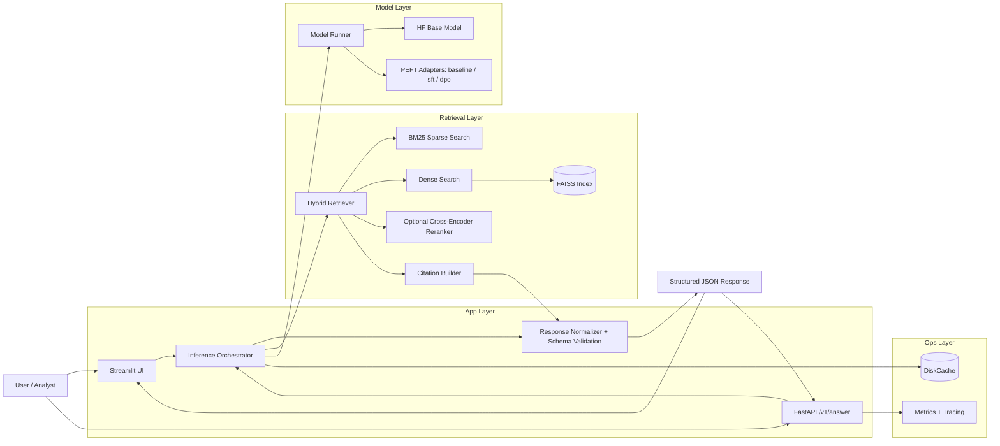
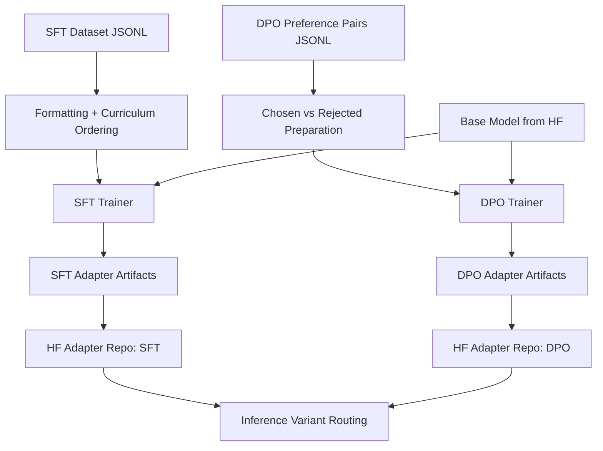
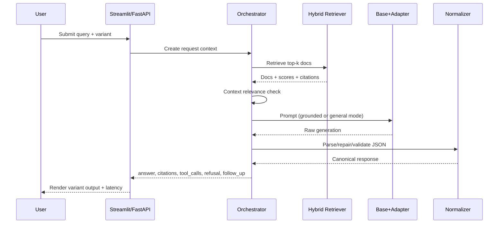
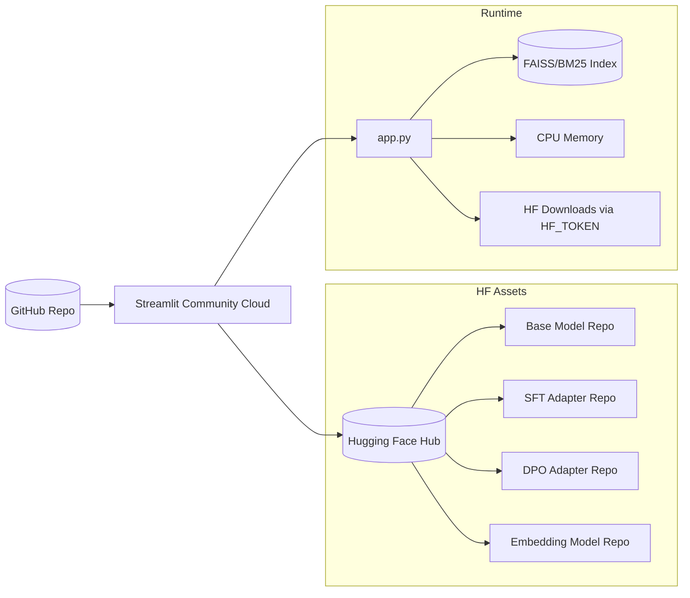
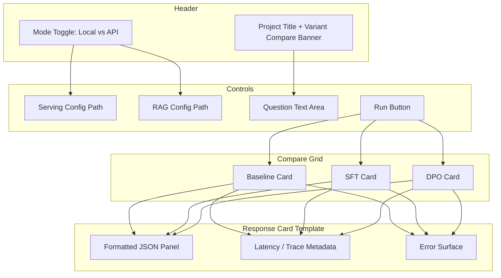
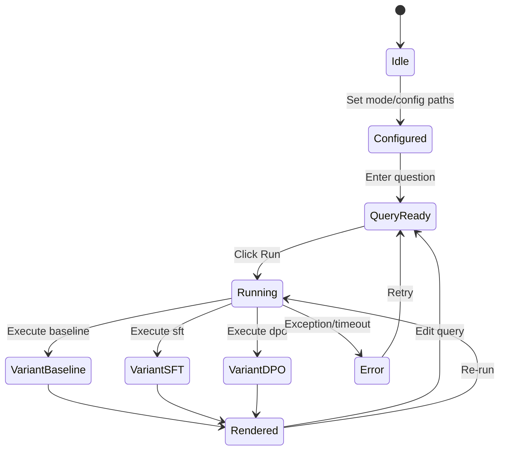
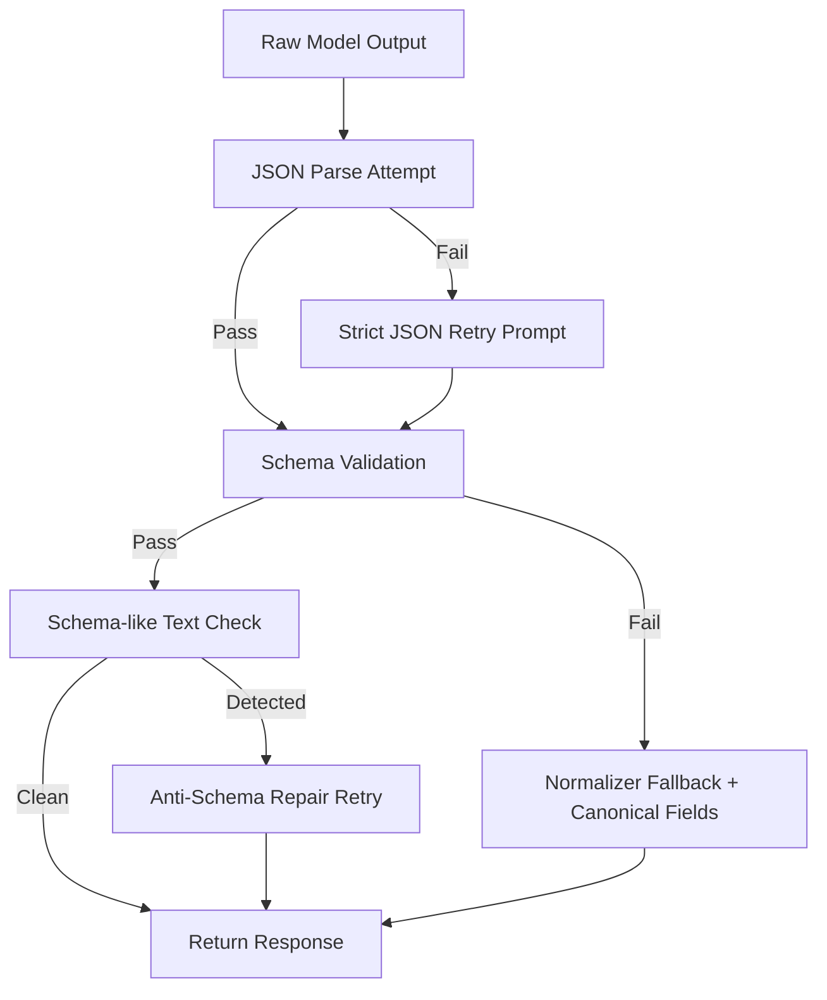

# Architecture and UI Diagrams

This document provides presentation-ready architecture diagrams for the HealthcareOps LLM workflow.

---

## 1) End-to-End Platform Architecture

---

## 2) Training and Alignment Pipeline (SFT + DPO)

---

## 3) Inference Request Lifecycle

---

## 4) Deployment Topology (Cloud-Friendly)

---

## 5) Streamlit UI Architecture (Look-Feel + Behavior)

---

## 6) UI Interaction and State Flow

---

## 7) Reliability Controls (Output Quality)

---

## 8) Notes for Presentations

- Use Diagram 1 for overall architecture.
- Use Diagram 2 for model alignment story (SFT -> DPO).
- Use Diagram 3 when explaining runtime flow.
- Use Diagram 5 + 6 for UI/UX architecture discussion.
- Use Diagram 7 to explain robustness and why outputs remain structured.

